# DOCUMENTAÇÃO TÉCNICA — SISTEMA CORPORATIVO DE GERENCIAMENTO DE TICKETS (ITSM)

## Visão Geral

### Nome Provisório do Sistema

- GateDesk
- CoreDesk
- NexusITSM
- FlowDesk
- ServiceHub
- HelixDesk

---

# 1. OBJETIVO DO PROJETO

Desenvolver uma plataforma corporativa de gerenciamento de tickets baseada nas melhores práticas do ITIL v4, com arquitetura moderna, modular, escalável e orientada a APIs.

O sistema deverá atender processos de:

- Gestão de Incidentes
- Gestão de Requisições de Serviço
- Gestão de Problemas
- Gestão de Mudanças
- Aprovações Multietapas
- SLA Inteligente
- Base de Conhecimento
- Auditoria Completa
- Automação de Fluxos
- Dashboard Operacional
- Multiempresa (futuro)

---

# 2. OBJETIVOS TÉCNICOS

## Requisitos Estratégicos

- Escalabilidade horizontal
- Arquitetura modular
- API RESTful
- Preparação para microsserviços
- Alta rastreabilidade
- Segurança corporativa
- Facilidade de manutenção
- Baixo acoplamento
- Alta coesão
- Responsividade
- Preparação mobile

---

# 3. STACK TECNOLÓGICA

## Backend

| Tecnologia | Finalidade |
|---|---|
| Node.js | Runtime |
| NestJS | Framework backend |
| TypeScript | Linguagem principal |
| Prisma ORM | ORM |
| PostgreSQL | Banco relacional |
| Redis | Cache e filas |
| BullMQ | Processamento assíncrono |
| JWT | Autenticação |
| Swagger | Documentação API |
| Socket.IO | Realtime |
| Docker | Containerização | (Futuro)

---

## Frontend

| Tecnologia | Finalidade |
|---|---|
| React | Frontend |
| Vite | Build |
| TypeScript | Linguagem |
| DaisyUI | TailwindCSS | Estilização |
| React Query | Cache e requests |
| Zustand | Gerenciamento de estado |
| React Hook Form | Formulários |
| Zod | Validações |
| Axios | HTTP Client |
| Socket.IO Client | Realtime |

---

# 4. ARQUITETURA GERAL

## Arquitetura Base

```txt
Frontend React
     ↓
API Gateway (NestJS)
     ↓
Módulos de Negócio
     ↓
Banco PostgreSQL
     ↓
Redis + Filas + Cache
```

---

## Padrões Arquiteturais

- Clean Architecture
- Domain Driven Design (DDD)
- SOLID
- Repository Pattern
- CQRS (futuro)
- Event Driven (futuro)

---

# 5. MÓDULOS DO SISTEMA

# 5.1 CORE

## Auth

Responsável por:

- Login
- Logout
- Refresh Token
- MFA futuro
- Sessões
- Controle JWT

---

## Users

Responsável por:

- Cadastro usuários
- Perfis
- Técnicos
- Colaboradores
- Gestão de status

---

## Roles & Permissions

RBAC corporativo.

### Exemplo:

```txt
Administrador
Supervisor
Técnico
Solicitante
CAB
Gestor
```

---

## Notifications

- E-mail
- Push
- Internas
- Realtime

---

## Audit

Registro completo:

- Alterações
- Login
- Exclusões
- Aprovações
- SLA
- Histórico

---

## Files

- Upload
- Download
- Versionamento futuro
- Controle de acesso

---

# 5.2 ITIL MODULES

## Incidents

Gerenciamento de incidentes.

### Fluxo

```txt
Abertura
→ Classificação
→ Priorização
→ Atendimento
→ Escalonamento
→ Resolução
→ Encerramento
```

---

## Service Requests

Requisições operacionais.

### Exemplos

- Acesso sistema
- Instalação software
- Novo usuário
- Liberação VPN

---

## Problems

Controle causa raiz.

### Objetivos

- RCA
- Workarounds
- Erros conhecidos
- Correções definitivas

---

## Changes

Gestão de mudanças.

### Fluxo

```txt
RFC
→ Aprovação
→ Planejamento
→ Execução
→ Validação
→ Encerramento
```

---

## Knowledge Base

Base de conhecimento corporativa.

### Recursos

- Artigos
- FAQ
- Procedimentos
- Versionamento
- Aprovação conteúdo

---

## SLA

Gestão inteligente de SLA.

### Recursos

- SLA dinâmico
- Escalonamento
- Pausa SLA
- Reabertura
- Horário comercial
- Feriados
- VIP

---

## Workflows

Motor de automações.

### Exemplo

```txt
SE categoria = ERP
ENTÃO atribuir grupo SAP
```

---

## Approvals

Aprovações multinível.

### Fluxo exemplo

```txt
Solicitante
→ Gestor
→ Segurança
→ TI
→ Finalizado
```

---

# 6. MODELO DE PERMISSÕES

# RBAC

## Estrutura

```txt
roles
permissions
role_permissions
user_roles
```

---

## Exemplo de Permissões

```txt
user.create
user.edit
user.delete

incident.create
incident.assign
incident.close

change.approve
change.execute

sla.manage
workflow.manage
```

---

# 7. AUTENTICAÇÃO E SEGURANÇA

## JWT

### Access Token

- Expiração curta
- 15 minutos

### Refresh Token

- 7 dias
- Rotação segura

---

## Segurança Aplicada

- Bcrypt/Argon2
- Helmet
- CORS
- Rate Limiter
- Logs auditoria
- Criptografia sensível
- Sessões rastreáveis
- Proteção brute force

---

# 8. ESTRUTURA DO BANCO DE DADOS

# Principais Tabelas

## Usuários

```sql
users
roles
permissions
user_roles
role_permissions
```

---

## Tickets

```sql
tickets
ticket_comments
ticket_histories
ticket_attachments
ticket_statuses
ticket_priorities
```

---

## SLA

```sql
slas
sla_rules
sla_histories
sla_events
```

---

## Aprovações

```sql
approval_flows
approval_steps
approval_histories
```

---

## Workflow

```sql
workflow_rules
workflow_actions
workflow_conditions
```

---

## Auditoria

```sql
audit_logs
access_logs
system_logs
```

---

# 9. MODELAGEM DO TICKET

## Estrutura Base

```sql
CREATE TABLE tickets (
    id UUID PRIMARY KEY,
    protocol VARCHAR(20),
    title VARCHAR(255),
    description TEXT,
    status_id UUID,
    priority_id UUID,
    requester_id UUID,
    assigned_to UUID,
    category_id UUID,
    sla_id UUID,
    opened_at TIMESTAMP,
    resolved_at TIMESTAMP,
    closed_at TIMESTAMP,
    created_at TIMESTAMP,
    updated_at TIMESTAMP
);
```

---

# 10. SLA INTELIGENTE

## Critérios SLA

- Categoria
- Impacto
- Urgência
- Cliente VIP
- Departamento
- Tipo ticket
- Horário comercial

---

## Exemplo de SLA

| Prioridade | Primeira Resposta | Resolução |
|---|---|---|
| Crítica | 15 min | 4 horas |
| Alta | 30 min | 8 horas |
| Média | 2 horas | 24 horas |
| Baixa | 8 horas | 72 horas |

---

## Eventos SLA

- SLA iniciado
- SLA pausado
- SLA retomado
- SLA violado
- SLA concluído

---

# 11. ESTRUTURA API REST

# Auth

```http
POST /auth/login
POST /auth/refresh
POST /auth/logout
```

---

# Users

```http
GET /users
POST /users
PATCH /users/:id
DELETE /users/:id
```

---

# Tickets

```http
GET /tickets
POST /tickets
GET /tickets/:id
PATCH /tickets/:id
POST /tickets/:id/comments
POST /tickets/:id/attachments
```

---

# Approvals

```http
POST /approvals/:id/approve
POST /approvals/:id/reject
```

---

# SLA

```http
GET /slas
POST /slas
PATCH /slas/:id
```

---

# 12. ESTRUTURA BACKEND

```txt
src/
 ├── modules/
 │    ├── auth/
 │    ├── users/
 │    ├── tickets/
 │    ├── approvals/
 │    ├── sla/
 │    ├── workflows/
 │    └── audit/
 │
 ├── common/
 ├── infra/
 ├── config/
 ├── prisma/
 └── main.ts
```

---

# 13. ESTRUTURA FRONTEND

```txt
src/
 ├── pages/
 ├── components/
 ├── layouts/
 ├── hooks/
 ├── routes/
 ├── services/
 ├── store/
 ├── types/
 ├── contexts/
 └── utils/
```

---

# 14. DASHBOARD OPERACIONAL

## Indicadores

- Tickets abertos
- Tickets críticos
- SLA violados
- MTTR
- MTTA
- CSAT
- Backlog
- Técnicos online

---

# 15. REALTIME

## Recursos Realtime

- Atualização ticket
- Chat interno
- Notificações
- Aprovações
- SLA countdown

---

# 16. SISTEMA DE NOTIFICAÇÕES

## Tipos

- E-mail
- Push
- Sistema
- WebSocket

---

## Eventos

- Ticket criado
- Ticket atribuído
- SLA próximo violação
- Aprovação pendente
- Ticket encerrado

---

# 17. AUDITORIA E COMPLIANCE

## Registro Completo

- Quem alterou
- O que alterou
- Quando alterou
- IP
- Sessão
- Origem

---

# 18. PREPARAÇÃO MULTIEMPRESA

## Estratégias

### Shared Database

```txt
tenant_id
```

---

### Futuro

- Isolamento tenant
- White-label
- Subdomínios
- Configuração individual

---

# 19. ROADMAP DO PROJETO

# MVP

## Fase 1

- Login
- Usuários
- Tickets
- Comentários
- Dashboard básico
- SLA simples

---

## Fase 2

- Aprovações
- Workflow
- Realtime
- Notificações
- Base conhecimento

---

## Fase 3

- Problemas
- Mudanças
- CMDB
- Relatórios avançados
- BI

---

## Fase 4

- IA
- Chatbot
- NLP
- Classificação automática
- Predição SLA

---

# 20. DEVOPS

## Infraestrutura

- Docker
- Docker Compose
- NGINX
- CI/CD
- GitHub Actions
- Monitoramento
- Logs centralizados

---

## Ambientes

```txt
DEV
HML
PRD
```

---

# 21. MONITORAMENTO

## Ferramentas Futuras

- Prometheus
- Grafana
- Sentry
- Loki
- ELK Stack

---

# 22. TESTES

## Backend

- Unitários
- Integração
- E2E

---

## Frontend

- Componentes
- Fluxos
- Integração

---

# 23. PADRONIZAÇÃO

## Backend

- ESLint
- Prettier
- Husky
- Conventional Commits

---

## Frontend

- Atomic Design
- Componentização
- Hooks reutilizáveis

---

# 24. FUTURAS INTEGRAÇÕES

## Possíveis Integrações

- Microsoft 365
- Active Directory
- LDAP
- Teams
- Slack
- WhatsApp
- GLPI Import
- Zabbix
- Grafana
- Jira

---

# 25. DIFERENCIAIS ESTRATÉGICOS

## Diferenciais

- SLA inteligente
- Workflow visual
- Aprovação multinível
- Estrutura modular
- Preparação SaaS
- ITIL v4
- Escalabilidade
- Auditoria completa

---

# 26. DER CORPORATIVO (DIAGRAMA ENTIDADE RELACIONAMENTO)

## Visão Geral

O modelo relacional foi projetado com foco em:

- Escalabilidade
- Modularidade
- Multiempresa
- Conformidade ITIL v4
- Auditoria
- Segurança
- Alta rastreabilidade

---

# 26.1 ENTIDADES PRINCIPAIS

## CORE

```txt
users
roles
permissions
user_roles
role_permissions
companies
departments
notifications
audit_logs
files
sessions
```

---

## TICKETS

```txt
tickets
ticket_comments
ticket_histories
ticket_attachments
ticket_statuses
ticket_priorities
ticket_categories
ticket_types
```

---

## SLA

```txt
slas
sla_rules
sla_events
sla_histories
business_hours
holidays
```

---

## APPROVALS

```txt
approval_flows
approval_steps
approval_requests
approval_histories
```

---

## WORKFLOWS

```txt
workflow_rules
workflow_conditions
workflow_actions
workflow_executions
```

---

## KNOWLEDGE BASE

```txt
knowledge_articles
knowledge_categories
knowledge_versions
knowledge_feedbacks
```

---

## CHANGES

```txt
changes
change_tasks
change_risks
change_approvals
```

---

## PROBLEMS

```txt
problems
problem_incidents
known_errors
root_causes
```

---

# 26.2 RELACIONAMENTOS PRINCIPAIS

## Usuários

```txt
users 1:N tickets
users 1:N ticket_comments
users N:N roles
roles N:N permissions
```

---

## Tickets

```txt
tickets 1:N ticket_comments
tickets 1:N ticket_histories
tickets 1:N ticket_attachments
tickets N:1 ticket_statuses
tickets N:1 ticket_priorities
tickets N:1 ticket_categories
```

---

## SLA

```txt
slas 1:N sla_rules
slas 1:N tickets
tickets 1:N sla_events
```

---

## Aprovações

```txt
approval_flows 1:N approval_steps
tickets 1:N approval_requests
approval_requests 1:N approval_histories
```

---

# 26.3 DER EM MERMAID

```mermaid
erDiagram

    USERS {
        uuid id PK
        varchar name
        varchar email
        varchar password_hash
        uuid department_id FK
        uuid company_id FK
        boolean active
        timestamp created_at
    }

    ROLES {
        uuid id PK
        varchar name
        varchar description
    }

    PERMISSIONS {
        uuid id PK
        varchar key
        varchar description
    }

    USER_ROLES {
        uuid user_id FK
        uuid role_id FK
    }

    ROLE_PERMISSIONS {
        uuid role_id FK
        uuid permission_id FK
    }

    DEPARTMENTS {
        uuid id PK
        varchar name
    }

    COMPANIES {
        uuid id PK
        varchar name
        varchar document
    }

    TICKETS {
        uuid id PK
        varchar protocol
        varchar title
        text description
        uuid requester_id FK
        uuid assigned_to FK
        uuid status_id FK
        uuid priority_id FK
        uuid category_id FK
        uuid sla_id FK
        timestamp opened_at
        timestamp resolved_at
        timestamp closed_at
    }

    TICKET_COMMENTS {
        uuid id PK
        uuid ticket_id FK
        uuid user_id FK
        text comment
        boolean internal
        timestamp created_at
    }

    TICKET_HISTORIES {
        uuid id PK
        uuid ticket_id FK
        uuid user_id FK
        varchar field
        varchar old_value
        varchar new_value
        timestamp created_at
    }

    TICKET_ATTACHMENTS {
        uuid id PK
        uuid ticket_id FK
        uuid uploaded_by FK
        varchar file_name
        varchar file_path
        timestamp created_at
    }

    TICKET_STATUSES {
        uuid id PK
        varchar name
        varchar color
    }

    TICKET_PRIORITIES {
        uuid id PK
        varchar name
        integer level
    }

    TICKET_CATEGORIES {
        uuid id PK
        varchar name
        uuid parent_id FK
    }

    SLAS {
        uuid id PK
        varchar name
        integer response_time
        integer resolution_time
    }

    SLA_RULES {
        uuid id PK
        uuid sla_id FK
        varchar priority
        varchar impact
    }

    SLA_EVENTS {
        uuid id PK
        uuid ticket_id FK
        varchar event_type
        timestamp event_time
    }

    APPROVAL_FLOWS {
        uuid id PK
        varchar name
        varchar entity_type
    }

    APPROVAL_STEPS {
        uuid id PK
        uuid flow_id FK
        integer step_order
        varchar approver_type
    }

    APPROVAL_REQUESTS {
        uuid id PK
        uuid ticket_id FK
        uuid flow_id FK
        varchar status
    }

    APPROVAL_HISTORIES {
        uuid id PK
        uuid request_id FK
        uuid approved_by FK
        varchar action
        text comments
        timestamp created_at
    }

    WORKFLOW_RULES {
        uuid id PK
        varchar name
        boolean active
    }

    WORKFLOW_CONDITIONS {
        uuid id PK
        uuid workflow_id FK
        varchar field
        varchar operator
        varchar value
    }

    WORKFLOW_ACTIONS {
        uuid id PK
        uuid workflow_id FK
        varchar action_type
        text payload
    }

    KNOWLEDGE_ARTICLES {
        uuid id PK
        varchar title
        text content
        uuid category_id FK
        uuid author_id FK
    }

    PROBLEMS {
        uuid id PK
        varchar title
        text root_cause
        varchar status
    }

    CHANGES {
        uuid id PK
        varchar title
        text description
        varchar risk
        varchar status
    }

    USERS ||--o{ USER_ROLES : has
    ROLES ||--o{ USER_ROLES : contains

    ROLES ||--o{ ROLE_PERMISSIONS : grants
    PERMISSIONS ||--o{ ROLE_PERMISSIONS : assigned

    COMPANIES ||--o{ USERS : owns
    DEPARTMENTS ||--o{ USERS : contains

    USERS ||--o{ TICKETS : requester
    USERS ||--o{ TICKET_COMMENTS : writes

    TICKETS ||--o{ TICKET_COMMENTS : has
    TICKETS ||--o{ TICKET_HISTORIES : generates
    TICKETS ||--o{ TICKET_ATTACHMENTS : contains

    TICKET_STATUSES ||--o{ TICKETS : status
    TICKET_PRIORITIES ||--o{ TICKETS : priority
    TICKET_CATEGORIES ||--o{ TICKETS : category

    SLAS ||--o{ SLA_RULES : defines
    SLAS ||--o{ TICKETS : applies

    TICKETS ||--o{ SLA_EVENTS : logs

    APPROVAL_FLOWS ||--o{ APPROVAL_STEPS : contains
    APPROVAL_FLOWS ||--o{ APPROVAL_REQUESTS : generates

    APPROVAL_REQUESTS ||--o{ APPROVAL_HISTORIES : tracks

    WORKFLOW_RULES ||--o{ WORKFLOW_CONDITIONS : defines
    WORKFLOW_RULES ||--o{ WORKFLOW_ACTIONS : executes

    USERS ||--o{ KNOWLEDGE_ARTICLES : creates

```



---

# 26.4 REGRAS OPERACIONAIS

## Tickets

- Todo ticket deve possuir solicitante.
- Todo ticket deve possuir status.
- Todo ticket pode possuir SLA.
- Todo ticket pode possuir múltiplos comentários.
- Todo ticket deve gerar histórico de alterações.

---

## Aprovações

- Aprovação pode possuir múltiplas etapas.
- Cada etapa possui aprovador específico.
- Reprovação encerra fluxo.

---

## SLA

- SLA pode ser pausado.
- SLA deve considerar calendário.
- SLA deve registrar violações.

---

## Auditoria

- Toda alteração crítica deve gerar log.
- Exclusões devem ser soft delete.
- Sessões devem ser rastreadas.

---

# 26.5 ESTRATÉGIA FUTURA

## Evolução Planejada

- Multi-tenant completo
- Microsserviços
- Event sourcing
- CQRS
- CMDB avançado
- IA preditiva
- Workflow visual drag-and-drop
- Automação low-code

---

# 27. CONSIDERAÇÕES FINAIS

A plataforma foi planejada para operar como um sistema corporativo robusto de ITSM, com foco em:

- Escalabilidade
- Segurança
- Governança
- Performance
- Modularidade
- Conformidade ITIL v4
- Preparação SaaS
- Evolução futura para IA e automações avançadas

A arquitetura permite crescimento gradual sem necessidade de reestruturação completa do sistema.

