# DOCUMENTAÇÃO TÉCNICA — SISTEMA CORPORATIVO DE GERENCIAMENTO DE TICKETS (ITSM)

## Visão Geral

### Nome Provisório do Sistema

- GateDesk
- CoreDesk
- NexusITSM
- FlowDesk
- ServiceHub
- HelixDesk

---

# 1. OBJETIVO DO PROJETO

Desenvolver uma plataforma corporativa de gerenciamento de tickets baseada nas melhores práticas do ITIL v4, com arquitetura moderna, modular, escalável e orientada a APIs.

O sistema deverá atender processos de:

- Gestão de Incidentes
- Gestão de Requisições de Serviço
- Gestão de Problemas
- Gestão de Mudanças
- Aprovações Multietapas
- SLA Inteligente
- Base de Conhecimento
- Auditoria Completa
- Automação de Fluxos
- Dashboard Operacional
- Multiempresa (futuro)

---

# 2. OBJETIVOS TÉCNICOS

## Requisitos Estratégicos

- Escalabilidade horizontal
- Arquitetura modular
- API RESTful
- Preparação para microsserviços
- Alta rastreabilidade
- Segurança corporativa
- Facilidade de manutenção
- Baixo acoplamento
- Alta coesão
- Responsividade
- Preparação mobile

---

# 3. STACK TECNOLÓGICA

## Backend

| Tecnologia | Finalidade |
|---|---|
| Node.js v24 | Runtime |
| NestJS | Framework backend |
| TypeScript | Linguagem principal |
| Prisma ORM | ORM |
| PostgreSQL v18 | Banco relacional |
| JWT (Passport) | Autenticação |
| Swagger | Documentação API |
| Socket.IO | Realtime |
| bcryptjs | Hash de senhas |
| @nestjs/throttler | Rate limiter (30 req/60s) |

---

## Frontend

| Tecnologia | Finalidade |
|---|---|
| React | Frontend |
| Vite | Build |
| TypeScript | Linguagem |
| DaisyUI 4 | Componentes TailwindCSS |
| TanStack Query (React Query) | Cache e requests |
| Zustand | Gerenciamento de estado |
| Axios | HTTP Client |
| Socket.IO Client | Realtime |
| React Router | Roteamento |
| lucide-react | Ícones SVG |

---

# 4. ARQUITETURA GERAL

## Arquitetura Base

```txt
Frontend React
     ↓
API Gateway (NestJS)
     ↓
Módulos de Negócio
     ↓
Banco PostgreSQL
     ↓
Redis + Filas + Cache
```

---

## Padrões Arquiteturais

- Clean Architecture
- Domain Driven Design (DDD)
- SOLID
- Repository Pattern
- CQRS (futuro)
- Event Driven (futuro)

---

# 5. MÓDULOS DO SISTEMA

# 5.1 CORE

## Auth (✅ implementado)

Responsável por:

- Login (POST /api/auth/login)
- Logout (POST /api/auth/logout)
- Refresh Token (POST /api/auth/refresh)
- JWT Access Token (15min) + Refresh Token (7 dias) com rotação segura
- JwtAuthGuard global + `@Public()` para rotas públicas
- RolesGuard + `@Roles()` para autorização por perfil

---

## Users (✅ implementado)

Responsável por:

- CRUD completo (GET, POST, PATCH, DELETE)
- Associação de perfis (POST/DELETE /users/:id/roles/:roleId)
- Soft delete
- Seed inicial: admin@arkanhub.com / admin123

---

## Roles & Permissions (✅ implementado)

RBAC corporativo.

### Perfis implementados:

- **Administrador** — acesso total
- **Supervisor** — gestão de tickets e equipe
- **Técnico** — atendimento de tickets
- **Solicitante** — abertura de tickets
- **Gestor** — aprovações e relatórios

### Permissões (18 seeds):

```txt
user.create, user.edit, user.delete, user.view
ticket.create, ticket.edit, ticket.delete, ticket.assign, ticket.close
sla.create, sla.edit, sla.delete, sla.view
approval.approve, approval.reject
workflow.manage
report.view
knowledge.manage
```

---

## Notifications (✅ implementado)

- Internas (CRUD: GET, POST, PATCH read, PATCH read-all, DELETE)
- Badge de não lidas no header (polling 30s + tempo real via Socket.IO)
- Frontend: página /notifications

---

## Audit (✅ implementado)

Registro completo via Prisma @updatedAt e ticket_histories.

---

## Files (✅ implementado)

- Upload/download de anexos em tickets (multer)
- Servidos via GET /tickets/:id/attachments/:id/download

---

# 5.2 ITIL MODULES

## Incidents / Service Requests (✅ implementado via Tickets)

Gerenciamento de tickets unificado (incidentes + requisições).

### Fluxo

```txt
Aberto
→ Em Andamento
→ Aguardando
→ Resolvido
→ Fechado
```

### Recursos:

- Protocolo automático
- Comentários públicos e internos
- Anexos
- Histórico de alterações
- SLA por prioridade

---

## Problems (✅ implementado)

Controle de causa raiz.

### Status:

```txt
open → investigating → root_cause_identified → resolved → closed
```

### Recursos:

- RCA (Root Cause Analysis)
- Workaround e solução definitiva
- Erros conhecidos (KnownError) — vinculados a problemas ou independentes
- Frontend: página /problems com cards + modais

---

## Changes (✅ implementado)

Gestão de mudanças com aprovação CAB.

### Status:

```txt
draft → pending_review → approved → rejected → scheduled → implementing → validating → closed
```

### Recursos:

- Tipos: standard, normal, emergency
- Níveis de risco: low, medium, high
- Planos: implementação, rollback, testes
- Agendamento
- Aprovação multi-usuário (ChangeApproval)
- Frontend: página /changes com cards + modais

---

## Knowledge Base (✅ implementado)

Base de conhecimento corporativa.

### Recursos:

- Artigos com categorias
- Versionamento automático ao alterar conteúdo
- Restauração de versão anterior
- Frontend: página /knowledge com grid + modais

---

## SLA (✅ implementado)

Gestão de SLA.

### Recursos:

- CRUD de SLAs com regras por prioridade
- Cálculo de SLA via endpoint
- Horário comercial
- Seed: 3 SLAs (Corporativo, VIP, P1)

---

## Workflows (✅ implementado)

Motor de automações.

### Operadores:

```txt
equals, not_equals, contains, in, gt, lt
```

### Ações:

```txt
change_status, change_priority, assign_user, add_comment, send_notification
```

### Recursos:

- Execução automática ao criar/atualizar ticket
- Histórico de execuções
- Frontend: página /workflows com cards + modais

---

## Approvals (✅ implementado)

Aprovações multinível.

### Fluxo:

```txt
Passo 1 → Passo 2 → ... → Aprovado/Rejeitado
```

### Recursos:

- CRUD de fluxos com etapas ordenadas
- `currentStep` avança até aprovação total
- Rejeição encerra fluxo
- Frontend: página /approvals

---

## BI & Relatórios (✅ implementado)

### Indicadores:

- MTTR (Mean Time to Resolve)
- MTTA (Mean Time to Acknowledge)
- SLA compliance
- Total de tickets, backlog, críticos
- Distribuição por status, prioridade, categoria
- Tendência diária (criados vs resolvidos)

### Frontend:

- Página /reports com cards + gráficos CSS (sem lib externa)

---

## Realtime (✅ implementado)

### Socket.IO:

- Namespace `/ws` com autenticação JWT via handshake
- Salas: `user:{id}` (notificações individuais), `ticket:{id}` (atualizações)
- Eventos: `ticket:created`, `ticket:updated`, `comment:new`, `notification:new`
- Vite proxy: `/socket.io` com `ws: true`

---

# 6. MODELO DE PERMISSÕES

# RBAC

## Estrutura

```txt
roles
permissions
role_permissions
user_roles
```

---

## Exemplo de Permissões

```txt
user.create
user.edit
user.delete

incident.create
incident.assign
incident.close

change.approve
change.execute

sla.manage
workflow.manage
```

---

# 7. AUTENTICAÇÃO E SEGURANÇA

## JWT

### Access Token

- Expiração curta
- 15 minutos

### Refresh Token

- 7 dias
- Rotação segura

---

## Segurança Aplicada

- Bcrypt/Argon2
- Helmet
- CORS
- Rate Limiter
- Logs auditoria
- Criptografia sensível
- Sessões rastreáveis
- Proteção brute force

---

# 8. ESTRUTURA DO BANCO DE DADOS

# Principais Tabelas (~36 modelos Prisma)

## Core

```sql
users
roles
permissions
user_roles
role_permissions
```

---

## Tickets

```sql
tickets
ticket_comments
ticket_histories
ticket_attachments
ticket_statuses
ticket_priorities
ticket_categories
```

---

## SLA

```sql
slas
sla_rules
business_hours
```

---

## Aprovações (Fluxo de Aprovação)

```sql
approval_flows
approval_steps
approval_requests
approval_histories
```

---

## Workflow

```sql
workflow_rules
workflow_conditions
workflow_actions
workflow_executions
```

---

## Knowledge Base

```sql
knowledge_articles
knowledge_categories
knowledge_versions
```

---

## Notificações

```sql
notifications
```

---

## Problemas

```sql
problems
known_errors
```

---

## Mudanças

```sql
changes
change_approvals
```

---

# 9. MODELAGEM DO TICKET

## Estrutura Base

```sql
CREATE TABLE tickets (
    id UUID PRIMARY KEY,
    protocol VARCHAR(20),
    title VARCHAR(255),
    description TEXT,
    status_id UUID,
    priority_id UUID,
    requester_id UUID,
    assigned_to UUID,
    category_id UUID,
    sla_id UUID,
    opened_at TIMESTAMP,
    resolved_at TIMESTAMP,
    closed_at TIMESTAMP,
    created_at TIMESTAMP,
    updated_at TIMESTAMP
);
```

---

# 10. SLA INTELIGENTE

## Critérios SLA

- Categoria
- Impacto
- Urgência
- Cliente VIP
- Departamento
- Tipo ticket
- Horário comercial

---

## Exemplo de SLA

| Prioridade | Primeira Resposta | Resolução |
|---|---|---|
| Crítica | 15 min | 4 horas |
| Alta | 30 min | 8 horas |
| Média | 2 horas | 24 horas |
| Baixa | 8 horas | 72 horas |

---

## Eventos SLA

- SLA iniciado
- SLA pausado
- SLA retomado
- SLA violado
- SLA concluído

---

# 11. ESTRUTURA API REST

Todas as rotas são prefixadas com `/api` e protegidas por JWT (exceto auth).

# Auth

```http
POST /api/auth/login
POST /api/auth/refresh
POST /api/auth/logout
```

---

# Users

```http
GET    /api/users
POST   /api/users
PATCH  /api/users/:id
DELETE /api/users/:id
POST   /api/users/:userId/roles/:roleId
DELETE /api/users/:userId/roles/:roleId
```

---

# Roles

```http
GET    /api/roles
POST   /api/roles
PATCH  /api/roles/:id
DELETE /api/roles/:id
POST   /api/roles/:roleId/permissions/:permissionId
DELETE /api/roles/:roleId/permissions/:permissionId
```

---

# Permissions

```http
GET    /api/permissions
POST   /api/permissions
DELETE /api/permissions/:id
```

---

# Tickets

```http
GET    /api/tickets
POST   /api/tickets
GET    /api/tickets/:id
PATCH  /api/tickets/:id
POST   /api/tickets/:ticketId/comments
GET    /api/tickets/:ticketId/attachments
POST   /api/tickets/:ticketId/attachments
GET    /api/tickets/:ticketId/attachments/:id/download
```

---

# Ticket Aux (statuses, priorities, categories)

```http
GET /api/ticket-statuses
GET /api/ticket-priorities
GET /api/ticket-categories
```

---

# SLA

```http
GET    /api/slas
POST   /api/slas
PATCH  /api/slas/:id
DELETE /api/slas/:id
POST   /api/slas/:id/calculate
```

---

# Approval Flows

```http
GET    /api/approval-flows
GET    /api/approval-flows/:id
POST   /api/approval-flows
PATCH  /api/approval-flows/:id
DELETE /api/approval-flows/:id
POST   /api/approval-flows/:flowId/steps
DELETE /api/approval-flows/:flowId/steps/:stepId
POST   /api/approval-requests/:id/approve
POST   /api/approval-requests/:id/reject
```

---

# Knowledge Base

```http
GET    /api/knowledge/categories
POST   /api/knowledge/categories
DELETE /api/knowledge/categories/:id
GET    /api/knowledge/articles
GET    /api/knowledge/articles/:id
POST   /api/knowledge/articles
PATCH  /api/knowledge/articles/:id
DELETE /api/knowledge/articles/:id
GET    /api/knowledge/articles/:id/versions
POST   /api/knowledge/articles/:id/versions/:versionId/restore
```

---

# Notifications

```http
GET    /api/notifications
GET    /api/notifications/unread/count
POST   /api/notifications
PATCH  /api/notifications/:id/read
PATCH  /api/notifications/read-all
DELETE /api/notifications/:id
```

---

# Workflows

```http
GET    /api/workflows
GET    /api/workflows/:id
POST   /api/workflows
PATCH  /api/workflows/:id
DELETE /api/workflows/:id
POST   /api/workflows/:id/conditions
DELETE /api/workflows/conditions/:conditionId
POST   /api/workflows/:id/actions
DELETE /api/workflows/actions/:actionId
GET    /api/workflows/executions/all
POST   /api/workflows/:id/execute/:ticketId
```

---

# Problems

```http
GET    /api/problems
GET    /api/problems/:id
POST   /api/problems
PATCH  /api/problems/:id
DELETE /api/problems/:id
GET    /api/problems/known-errors/all
POST   /api/problems/known-errors
DELETE /api/problems/known-errors/:id
```

---

# Changes

```http
GET    /api/changes
GET    /api/changes/:id
POST   /api/changes
PATCH  /api/changes/:id
DELETE /api/changes/:id
POST   /api/changes/:id/approvals
PATCH  /api/changes/approvals/:approvalId
```

---

# BI & Reports

```http
GET /api/bi/overview
GET /api/bi/distribution
GET /api/bi/trends/:days
GET /api/bi/trends
```

---

# 12. ESTRUTURA BACKEND

```txt
apps/server/src/
 ├── modules/
 │    ├── auth/           — Login, JWT, refresh, guards
 │    ├── users/          — CRUD + role association
 │    ├── tickets/        — Tickets, comentários, anexos, status/prioridade/categoria aux
 │    ├── roles/          — CRUD + permission association
 │    ├── permissions/    — CRUD de permissões
 │    ├── sla/            — CRUD + cálculo
 │    ├── approvals/      — Fluxos de aprovação multi-etapas
 │    ├── knowledge/      — Artigos, categorias, versionamento, restauração
 │    ├── notifications/  — Notificações internas CRUD
 │    ├── websocket/      — Socket.IO gateway com JWT + salas
 │    ├── workflow/       — Regras, condições, ações, execução automática
 │    ├── problems/       — Problemas + erros conhecidos
 │    ├── changes/        — Mudanças + aprovações CAB
 │    └── bi/             — Agregados MTTR, MTTA, tendências, distribuição
 │
 ├── common/              — Decorators (@Public, @Roles), guards (JwtAuthGuard, RolesGuard)
 ├── infra/prisma/        — PrismaService
 └── main.ts              — Bootstrap NestJS
```

---

# 13. ESTRUTURA FRONTEND

```txt
apps/web/src/
 ├── pages/            — Dashboard, Tickets, Users, Slas, Approvals, Knowledge,
 │                        Workflows, Problems, Changes, Reports, Notifications, Login
 ├── components/       — UI reutilizáveis
 ├── components/layout/— Sidebar (colapsável w-56/w-64 → w-16 com tooltips), Header
 ├── hooks/            — useSocket (Socket.IO client)
 ├── routes/           — AppRoutes com ProtectedRoute
 ├── services/         — API clients (auth, users, tickets, slas, approvals, knowledge,
 │                        notifications, workflows, problems, changes, bi)
 ├── store/            — Zustand stores (auth, sidebar)
 ├── types/            — TypeScript interfaces (User, Ticket, Role, Permission, Sla,
 │                        ApprovalFlow, KnowledgeArticle, Notification, WorkflowRule,
 │                        Problem, Change, etc.)
 ├── contexts/         — ThemeProvider (wireframe/business + localStorage)
 └── utils/
```

---

# 14. DASHBOARD OPERACIONAL

## Indicadores

- Tickets abertos
- Tickets críticos
- SLA violados
- MTTR
- MTTA
- CSAT
- Backlog
- Técnicos online

---

# 15. REALTIME

## Recursos Realtime

- Atualização ticket
- Chat interno
- Notificações
- Aprovações
- SLA countdown

---

# 16. SISTEMA DE NOTIFICAÇÕES

## Tipos

- E-mail
- Push
- Sistema
- WebSocket

---

## Eventos

- Ticket criado
- Ticket atribuído
- SLA próximo violação
- Aprovação pendente
- Ticket encerrado

---

# 17. AUDITORIA E COMPLIANCE

## Registro Completo

- Quem alterou
- O que alterou
- Quando alterou
- IP
- Sessão
- Origem

---

# 18. PREPARAÇÃO MULTIEMPRESA

## Estratégias

### Shared Database

```txt
tenant_id
```

---

### Futuro

- Isolamento tenant
- White-label
- Subdomínios
- Configuração individual

---

# 19. ROADMAP DO PROJETO

# ✅ Fase 1 — MVP (COMPLETO)

- Login / Refresh / Logout (JWT)
- Usuários CRUD + RBAC (5 perfis, 18 permissões)
- Tickets CRUD + comentários + anexos
- SLA (CRUD + cálculo + horário comercial)
- Dashboard operacional
- Toggle tema (wireframe/business)
- Sidebar colapsável
- Layout mobile-first até 4K

---

# ✅ Fase 2 (COMPLETO)

- Aprovações multinível (fluxos + etapas + approve/reject)
- Workflow engine (regras, condições, ações, execução automática)
- Realtime (Socket.IO com JWT, salas user/ticket)
- Notificações internas (CRUD + badge + tempo real)
- Base de conhecimento (artigos, categorias, versionamento, restauração)

---

# ✅ Fase 3 (COMPLETO)

- Problemas (RCA, workaround, solução, erros conhecidos)
- Mudanças (RFC, aprovação CAB, planos, status lifecycle)
- BI & Relatórios avançados (MTTR, MTTA, SLA, distribuição, tendências)

---

## Fase 4 — IA & Automação (Futuro)

- Classificação automática de tickets (NLP)
- Chatbot
- Predição de SLA
- Recomendação de soluções (knowledge base)

---

## Futuro

- CMDB
- Multi-tenant
- Microsserviços

---

# 20. DEVOPS

## Infraestrutura

- Docker
- Docker Compose
- NGINX
- CI/CD
- GitHub Actions
- Monitoramento
- Logs centralizados

---

## Ambientes

```txt
DEV
HML
PRD
```

---

# 21. MONITORAMENTO

## Ferramentas Futuras

- Prometheus
- Grafana
- Sentry
- Loki
- ELK Stack

---

# 22. TESTES

## Backend

- Unitários
- Integração
- E2E

---

## Frontend

- Componentes
- Fluxos
- Integração

---

# 23. PADRONIZAÇÃO

## Backend

- ESLint
- Prettier
- Husky
- Conventional Commits

---

## Frontend

- Atomic Design
- Componentização
- Hooks reutilizáveis

---

# 24. FUTURAS INTEGRAÇÕES

## Possíveis Integrações

- Microsoft 365
- Active Directory
- LDAP
- Teams
- Slack
- WhatsApp
- GLPI Import
- Zabbix
- Grafana
- Jira

---

# 25. DIFERENCIAIS ESTRATÉGICOS

## Diferenciais

- SLA inteligente
- Workflow visual
- Aprovação multinível
- Estrutura modular
- Preparação SaaS
- ITIL v4
- Escalabilidade
- Auditoria completa

---

# 26. DER CORPORATIVO (DIAGRAMA ENTIDADE RELACIONAMENTO)

## Visão Geral

O modelo relacional foi projetado com foco em:

- Escalabilidade
- Modularidade
- Multiempresa
- Conformidade ITIL v4
- Auditoria
- Segurança
- Alta rastreabilidade

---

# 26.1 ENTIDADES PRINCIPAIS

## CORE

```txt
users
roles
permissions
user_roles
role_permissions
notifications
```

---

## TICKETS

```txt
tickets
ticket_comments
ticket_histories
ticket_attachments
ticket_statuses
ticket_priorities
ticket_categories
```

---

## SLA

```txt
slas
sla_rules
business_hours
```

---

## APPROVALS

```txt
approval_flows
approval_steps
approval_requests
approval_histories
```

---

## WORKFLOWS

```txt
workflow_rules
workflow_conditions
workflow_actions
workflow_executions
```

---

## KNOWLEDGE BASE

```txt
knowledge_articles
knowledge_categories
knowledge_versions
```

---

## CHANGES

```txt
changes
change_approvals
```

---

## PROBLEMS

```txt
problems
known_errors
```

---

# 26.2 RELACIONAMENTOS PRINCIPAIS

## Usuários

```txt
users 1:N tickets
users 1:N ticket_comments
users N:N roles
roles N:N permissions
```

---

## Tickets

```txt
tickets 1:N ticket_comments
tickets 1:N ticket_histories
tickets 1:N ticket_attachments
tickets N:1 ticket_statuses
tickets N:1 ticket_priorities
tickets N:1 ticket_categories
```

---

## SLA

```txt
slas 1:N sla_rules
slas N:N tickets (via sla_id)
```

---

## Aprovações

```txt
approval_flows 1:N approval_steps
tickets 1:N approval_requests
approval_requests 1:N approval_histories
```

---

## Knowledge Base

```txt
knowledge_categories 1:N knowledge_articles
knowledge_articles 1:N knowledge_versions
users 1:N knowledge_articles
```

---

## Workflows

```txt
workflow_rules 1:N workflow_conditions
workflow_rules 1:N workflow_actions
workflow_rules 1:N workflow_executions
tickets 1:N workflow_executions
```

---

## Notificações

```txt
users 1:N notifications
```

---

## Problemas

```txt
users 1:N problems (created_by)
users 1:N problems (assigned_to)
problems 1:N known_errors
```

---

## Mudanças

```txt
users 1:N changes (requester)
users 1:N changes (assignee)
changes 1:N change_approvals
users 1:N change_approvals (approver)
```

---

# 26.3 DER EM MERMAID

```mermaid
erDiagram

    USERS {
        uuid id PK
        varchar name
        varchar email
        varchar password_hash
        boolean active
        timestamp created_at
    }

    ROLES {
        uuid id PK
        varchar name
        varchar description
    }

    PERMISSIONS {
        uuid id PK
        varchar key
        varchar description
    }

    USER_ROLES {
        uuid user_id FK
        uuid role_id FK
    }

    ROLE_PERMISSIONS {
        uuid role_id FK
        uuid permission_id FK
    }

    TICKETS {
        uuid id PK
        varchar protocol
        varchar title
        text description
        uuid requester_id FK
        uuid assigned_to FK
        uuid status_id FK
        uuid priority_id FK
        uuid category_id FK
        uuid sla_id FK
        timestamp opened_at
        timestamp resolved_at
        timestamp closed_at
    }

    TICKET_COMMENTS {
        uuid id PK
        uuid ticket_id FK
        uuid user_id FK
        text comment
        boolean internal
        timestamp created_at
    }

    TICKET_HISTORIES {
        uuid id PK
        uuid ticket_id FK
        uuid user_id FK
        varchar field
        varchar old_value
        varchar new_value
        timestamp created_at
    }

    TICKET_ATTACHMENTS {
        uuid id PK
        uuid ticket_id FK
        uuid uploaded_by FK
        varchar file_name
        varchar file_path
        timestamp created_at
    }

    TICKET_STATUSES {
        uuid id PK
        varchar name
        varchar color
    }

    TICKET_PRIORITIES {
        uuid id PK
        varchar name
        integer level
    }

    TICKET_CATEGORIES {
        uuid id PK
        varchar name
        uuid parent_id FK
    }

    SLAS {
        uuid id PK
        varchar name
        integer response_time
        integer resolution_time
    }

    SLA_RULES {
        uuid id PK
        uuid sla_id FK
        varchar priority
        varchar impact
    }

    APPROVAL_FLOWS {
        uuid id PK
        varchar name
        varchar entity_type
    }

    APPROVAL_STEPS {
        uuid id PK
        uuid flow_id FK
        integer step_order
        varchar approver_type
    }

    APPROVAL_REQUESTS {
        uuid id PK
        uuid ticket_id FK
        uuid flow_id FK
        varchar status
    }

    APPROVAL_HISTORIES {
        uuid id PK
        uuid request_id FK
        uuid approved_by FK
        varchar action
        text comments
        timestamp created_at
    }

    WORKFLOW_RULES {
        uuid id PK
        varchar name
        boolean active
    }

    WORKFLOW_CONDITIONS {
        uuid id PK
        uuid workflow_id FK
        varchar field
        varchar operator
        varchar value
    }

    WORKFLOW_ACTIONS {
        uuid id PK
        uuid workflow_id FK
        varchar action_type
        text payload
    }

    KNOWLEDGE_CATEGORIES {
        uuid id PK
        varchar name
    }

    KNOWLEDGE_ARTICLES {
        uuid id PK
        varchar title
        text content
        uuid category_id FK
        uuid author_id FK
        timestamp created_at
        timestamp updated_at
    }

    KNOWLEDGE_VERSIONS {
        uuid id PK
        uuid article_id FK
        text content
        integer version
    }

    NOTIFICATIONS {
        uuid id PK
        uuid user_id FK
        varchar title
        text message
        varchar type
        boolean read
        uuid reference_id
        timestamp created_at
    }

    PROBLEMS {
        uuid id PK
        varchar title
        text description
        text root_cause
        text workaround
        text solution
        varchar status
        uuid created_by FK
        uuid assigned_to FK
        timestamp created_at
        timestamp resolved_at
    }

    KNOWN_ERRORS {
        uuid id PK
        varchar title
        text description
        text workaround
        text solution
        uuid problem_id FK
        timestamp created_at
    }

    CHANGES {
        uuid id PK
        varchar title
        text description
        varchar type
        varchar status
        varchar priority
        varchar risk_level
        text justification
        text implementation_plan
        text rollback_plan
        text test_plan
        uuid requester_id FK
        uuid assignee_id FK
        timestamp scheduled_at
        timestamp created_at
    }

    CHANGE_APPROVALS {
        uuid id PK
        uuid change_id FK
        uuid approved_by FK
        varchar role
        varchar status
        text comments
        timestamp created_at
    }

    WORKFLOW_EXECUTIONS {
        uuid id PK
        uuid workflow_id FK
        uuid ticket_id FK
        varchar status
        text result
        timestamp executed_at
    }

    USERS ||--o{ USER_ROLES : has
    ROLES ||--o{ USER_ROLES : contains

    ROLES ||--o{ ROLE_PERMISSIONS : grants
    PERMISSIONS ||--o{ ROLE_PERMISSIONS : assigned

    USERS ||--o{ TICKETS : requester
    USERS ||--o{ TICKET_COMMENTS : writes

    TICKETS ||--o{ TICKET_COMMENTS : has
    TICKETS ||--o{ TICKET_HISTORIES : generates
    TICKETS ||--o{ TICKET_ATTACHMENTS : contains

    TICKET_STATUSES ||--o{ TICKETS : status
    TICKET_PRIORITIES ||--o{ TICKETS : priority
    TICKET_CATEGORIES ||--o{ TICKETS : category

    SLAS ||--o{ SLA_RULES : defines

    APPROVAL_FLOWS ||--o{ APPROVAL_STEPS : contains
    APPROVAL_FLOWS ||--o{ APPROVAL_REQUESTS : generates

    APPROVAL_REQUESTS ||--o{ APPROVAL_HISTORIES : tracks
    APPROVAL_REQUESTS ||--o{ TICKETS : approves

    WORKFLOW_RULES ||--o{ WORKFLOW_CONDITIONS : defines
    WORKFLOW_RULES ||--o{ WORKFLOW_ACTIONS : executes
    WORKFLOW_RULES ||--o{ WORKFLOW_EXECUTIONS : logs

    KNOWLEDGE_CATEGORIES ||--o{ KNOWLEDGE_ARTICLES : categorizes
    USERS ||--o{ KNOWLEDGE_ARTICLES : creates
    KNOWLEDGE_ARTICLES ||--o{ KNOWLEDGE_VERSIONS : versions

    USERS ||--o{ NOTIFICATIONS : receives

    USERS ||--o{ PROBLEMS : reports
    USERS ||--o{ PROBLEMS : assigned_problems
    PROBLEMS ||--o{ KNOWN_ERRORS : has

    USERS ||--o{ CHANGES : requests
    USERS ||--o{ CHANGES : assigned_changes
    CHANGES ||--o{ CHANGE_APPROVALS : requires
    USERS ||--o{ CHANGE_APPROVALS : approves

    WORKFLOW_EXECUTIONS ||--o{ TICKETS : executes_on

```



---

# 26.4 REGRAS OPERACIONAIS

## Tickets

- Todo ticket deve possuir solicitante.
- Todo ticket deve possuir status.
- Todo ticket pode possuir SLA.
- Todo ticket pode possuir múltiplos comentários.
- Todo ticket deve gerar histórico de alterações.

---

## Aprovações

- Aprovação pode possuir múltiplas etapas.
- Cada etapa possui aprovador específico.
- Reprovação encerra fluxo.

---

## SLA

- SLA pode ser pausado.
- SLA deve considerar calendário.
- SLA deve registrar violações.

---

## Auditoria

- Toda alteração crítica deve gerar log.
- Exclusões devem ser soft delete.
- Sessões devem ser rastreadas.

---

# 26.5 ESTRATÉGIA FUTURA

## Evolução Planejada

- Multi-tenant completo
- Microsserviços
- Event sourcing
- CQRS
- CMDB avançado
- IA preditiva
- Workflow visual drag-and-drop
- Automação low-code

---

# 27. CONSIDERAÇÕES FINAIS

A plataforma foi planejada para operar como um sistema corporativo robusto de ITSM, com foco em:

- Escalabilidade
- Segurança
- Governança
- Performance
- Modularidade
- Conformidade ITIL v4
- Preparação SaaS
- Evolução futura para IA e automações avançadas

A arquitetura permite crescimento gradual sem necessidade de reestruturação completa do sistema.

